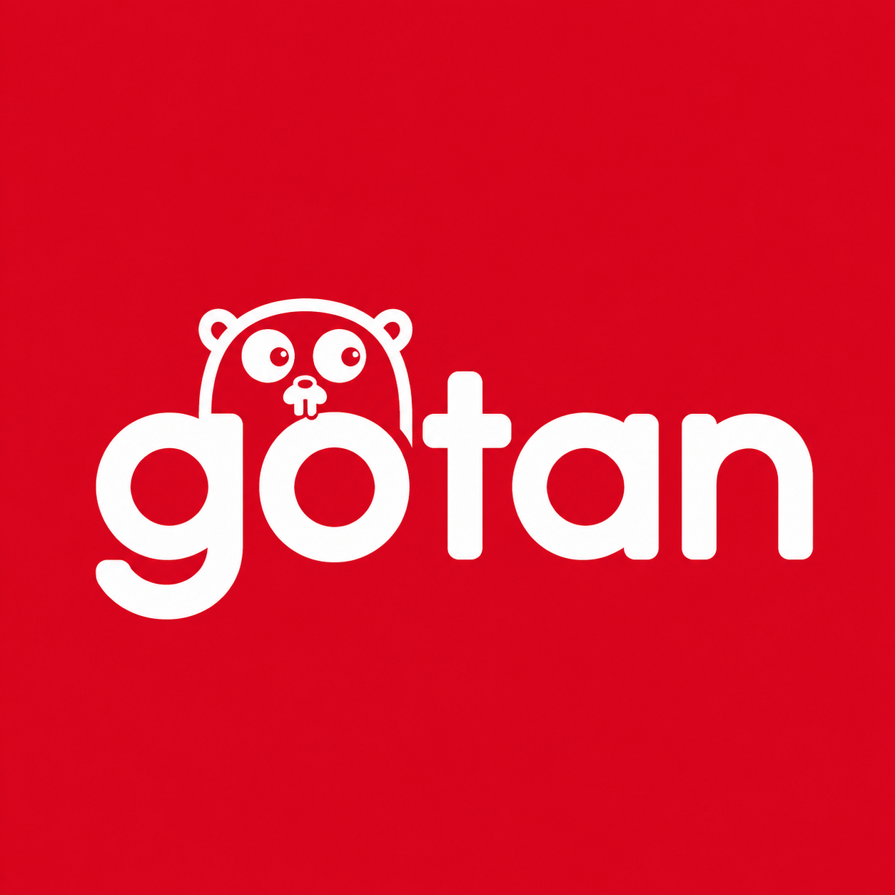

# Go探無比 (gotan) - Go Conference 2026 Workshop

**「Goの探索、豪胆無比に。」**

[株式会社アンドパッド](https://andpad.co.jp/)が [Go Conference 2026](https://gocon.jp/2026/) のために作成した、Goの調査スキルを鍛えるワークショップ教材です。

「Goの `time` フォーマット、毎回覚えられなくてググりがち…」
「この標準ライブラリの関数、errorを返す？それともpanicする？」

Goで開発していると、こうしたシーンに何度もぶつかります。そして、こうした疑問の多くは「一次情報」を正しくたどることで確実な答えにたどり着けます。

本ワークショップは、講師がすべてを解説する一方通行の講義ではありません。参加者自身が手を動かし、一次情報を使って自力で解決する**調査プロセスそのものを体験するグループワークショップ**です。

## 「Go探無比」の由来
**Go探無比** は、「Goの探索」と「豪胆無比」をかけたネーミングです。
かつて開催された、Goの研究や質実剛健をテーマにしたイベント「[質実Go研](https://github.com/goken/goken)」にリスペクトを込め、「わからないことに直面しても、豪胆無比にドキュメントの海を探索し自走できるGopherになろう」という思いが込められています。

## 作成元

このワークショップは [株式会社アンドパッド](https://andpad.co.jp/) が作成しました。
[Go Conference 2026](https://gocon.jp/2026/) のワークショップ「go.devの歩き方、その先へ 〜Go公式リソースの旅。明日からの調べ方を手に入れるワークショップ〜」の教材です。

- [ANDPAD Tech Blog](https://tech.andpad.co.jp/)
- [エンジニア採用サイト](https://engineer.andpad.co.jp/)

The Go gopher was designed by Renée French.

## ライセンス

[CC BY-NC 4.0](https://creativecommons.org/licenses/by-nc/4.0/) で公開しています。

**作成元を明示していただければ、どなたでも営利目的以外でこの教材を使ってワークショップを開催できます。**
翻訳しても、自分のコミュニティに合わせて設問を差し替えても構いません。

### 歓迎する利用

次のような使い方は歓迎します。事前の連絡は不要です。

- 社内外の勉強会、読書会、もくもく会でそのまま使う
- 地域のコミュニティや学生サークルのイベントとして開催する
- 設問を差し替える、翻訳する、自分たちのテーマを足す
- 会場費や懇親会費などの実費を賄うための参加費を集める（実費の範囲であれば、営利目的とはみなしません）

### 表示のしかた

そのままコピーして使ってください。

```text
「Go探無比 (gotan)」© ANDPAD Inc. / CC BY-NC 4.0
https://github.com/andpad-dev/gotan
```

内容を改変した場合は、改変した旨も併せて記載してください。

### 個別の相談が必要な利用

受講料を収益とする研修、販売を伴う書籍やコンテンツなど、営利を目的とした利用はこのライセンスの範囲外です。
そうした用途をご希望の場合や、歓迎する利用にあてはまるか判断に迷う場合は、[Issue](https://github.com/andpad-dev/gotan/issues) で聞いてください。

The creator:

* ANDPAD Inc.


------------------------------------------------------------------


# Go探無比 (gotan) - Go Conference 2026 Workshop

**"Explore Go with fearless determination."**

A workshop for sharpening your Go research skills, created by [ANDPAD Inc.](https://andpad.co.jp/) for [Go Conference 2026](https://gocon.jp/2026/).

"I keep having to look up Go's `time` formatting every time..."
"Does this standard library function return an error, or does it panic?"

When developing in Go, we run into situations like these again and again. In many cases, however, we can find reliable answers by correctly following the **primary sources**.

This workshop is not a one-way lecture where the instructor explains everything. Participants get hands-on experience with the **investigation process itself** by working together, using primary sources to solve problems independently.

## The Origin of "Go探無比"
**Go探無比** is a name that combines "exploring Go" with the Japanese expression "豪胆無比," meaning unparalleled boldness.
It was inspired by and pays tribute to the former event [質実Go研](https://github.com/goken/goken), which focused on Go research and steadfast craftsmanship. The name reflects our hope that participants will become self-reliant Gophers who boldly explore the sea of documentation whenever they encounter something they do not understand.

## Created by

This workshop was created by [ANDPAD Inc.](https://andpad.co.jp/)
It is the material for 「go.devの歩き方、その先へ 〜Go公式リソースの旅。明日からの調べ方を手に入れるワークショップ〜」, a workshop session at [Go Conference 2026](https://gocon.jp/2026/).

- [ANDPAD Tech Blog](https://tech.andpad.co.jp/)
- [Engineering careers](https://engineer.andpad.co.jp/)

The Go gopher was designed by Renée French.

## License

Licensed under [CC BY-NC 4.0](https://creativecommons.org/licenses/by-nc/4.0/).

**Anyone may run this workshop for non-commercial purposes, as long as you credit the creator.**
You are also free to translate it, or to swap in your own scenarios to fit your community.

### Uses we welcome

The following need no advance notice.

- Running it as is at a study group, reading group, or co-working session, inside or outside your company
- Holding it as a local community or student club event
- Swapping in your own questions, translating it, or adding your own themes
- Charging a fee that covers actual costs such as the venue or a social gathering (we do not treat cost recovery as a commercial purpose)

### How to credit

Copy this as is.

```text
"Go探無比 (gotan)" © ANDPAD Inc. / CC BY-NC 4.0
https://github.com/andpad-dev/gotan
```

If you modify the material, please also state that changes were made.

### Uses that need a conversation

Training run for tuition revenue, and books or content sold for a fee, fall outside this license.
If you have such a use in mind, or you are unsure whether yours counts as one we welcome, ask on [Issues](https://github.com/andpad-dev/gotan/issues).

The creator:

* ANDPAD Inc.
